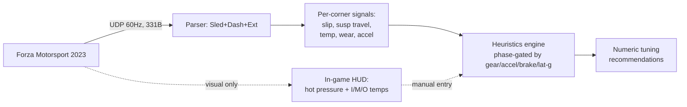

# Forza Motorsport (2023): All Tunable Car Values & Telemetry-Driven Optimization

> Research report for the `tuning-coach` project. Covers the complete FM 2023 (Turn 10
> reboot) tuning surface, the telemetry available to read (in-game overlay + UDP "Data
> Out"), per-subsystem optimization rules keyed to telemetry signals, and a cross-check
> against established real-world race-engineering theory.

---

## Executive Summary

Forza Motorsport (2023) exposes **nine tunable subsystems** — tires, gearing, alignment,
anti-roll bars, springs/ride-height, damping, aero, brakes, and differential — most with
documented slider ranges and starting points.[^forzaguide][^forzatune] The game emits two
streams of feedback: an **in-game telemetry HUD** (7 pages, including the critical Heat
page with inner/middle/outer tire temps) and a **UDP "Data Out" packet** (331-byte FM 2023
"Dash" format) broadcast at 60 Hz.[^dataout][^fandom] A tuning coach can read per-corner
slip, suspension travel, accelerations, RPM/speed, and (new in FM 2023) tire wear over
UDP — but **tire pressure and the inner/middle/outer temp bands are NOT in the UDP stream**,
a key architectural constraint.[^forzoid][^k0ool]

Optimization reduces to a small set of telemetry→action heuristics per subsystem (e.g.
"`NormalizedSuspensionTravel` pegs at 1.0 → raise ride height"; "rear slip-ratio spikes
under throttle → lower diff accel lock or raise rear pressure").[^codriver][^k0ool] These
sim heuristics align closely with real-world practice grounded in Milliken & Milliken,
Carroll Smith, and OptimumG: tire load sensitivity drives the understeer/oversteer balance
(stiffer end loses grip), the I/M/O pyrometer method sets pressure and camber, ride
frequency selects springs, and rebound > bump controls the platform.[^rcvd][^smith][^suspsecrets]

**Confidence:** High on UDP packet layout (official docs + 6 cross-verified parsers) and on
real-world theory (textbook-sourced). Medium on exact FM 2023 slider min/max (car-dependent,
community-derived; official tuning-menu docs were inaccessible).

---

## 1. Telemetry Foundation — What You Can Actually Read

A tuning recommendation is only as good as the signal behind it. FM 2023 gives two channels.

### 1.1 In-game Telemetry HUD (7 pages)

Toggle with **D-pad Down** (Xbox) / `Esc` (PC); cycle with **D-pad Right**.[^accessibility]
Page set is identical to FM7 with tire wear added.[^fandom]

| Page | Key tuning data |
|---|---|
| 1. General | Speed, gear, RPM, power, torque, boost, throttle/brake/clutch/steer |
| 2. Friction | Per-tire **traction (friction) circle** — long. vs lat. g, % of grip used |
| 3. Suspension | Per-corner suspension travel (normalized + meters) — ride-height/roll trace |
| 4. Body Acceleration | Lateral & longitudinal G time-series |
| 5. **Tires, Misc.** | Per-tire wheel speed, **live camber**, single temp band, **hot pressure**, **tire wear (NEW)** |
| 6. **Heat** | Per-tire **Inner / Middle / Outer** temperature strips (color bands) |
| 7. Damage | Engine/transmission/brake/suspension damage, fuel |

> **Critical:** Pages 5 (hot pressure) and 6 (I/M/O temps) carry the data needed for
> camber and pressure tuning — but **neither is exposed in the UDP stream**. They are
> visual-only.[^fandom][^forzoid]

### 1.2 UDP "Data Out" packet (FM 2023 "Dash" = 331 bytes, 60 Hz)

Configure at **Settings → Gameplay & HUD → UDP Race Telemetry**, format **"Dash"**. FM 2023
newly supports `127.0.0.1` as the destination.[^dataout] Structure is three concatenated
sections:

```
[0..231]   Sled  (232 B) — physics/motion           (legacy)
[232..310] Dash  (79 B)  — dashboard/UI             (same as FM7)
[311..330] Ext   (20 B)  — 4× TireWear + TrackOrdinal  ★ NEW in FM 2023
```

Disambiguate the source game by packet length: **232** = Sled-only, **311** = FM7 Dash,
**324** = Forza Horizon 4/5/6 (different layout), **331** = FM 2023 Dash.[^ets2]

**Tuning-relevant fields** (offsets from the cross-verified parsers):[^richstokes][^forzoid]

| Field(s) | Offset | Type | Tuning use |
|---|---|---|---|
| `CurrentEngineRpm` / `EngineMaxRpm` | 16 / 8 | F32 | Gearing — redline check |
| `AccelerationX/Y/Z` | 20–28 | F32 | Lat-g (aero/balance), long-g (brake) |
| `NormalizedSuspensionTravel{FL..RR}` | 68–80 | F32 0–1 | Springs/dampers/ride-height (bottoming at 1.0) |
| `TireSlipRatio{FL..RR}` | 84–96 | F32 | Wheelspin, brake lockup, diff |
| `WheelRotationSpeed{FL..RR}` | 100–112 | F32 rad/s | Inside/outside Δ, lockup→0 |
| `TireSlipAngle{FL..RR}` | 164–176 | F32 | Cornering balance, aero |
| `TireCombinedSlip{FL..RR}` | 180–192 | F32 | Overall grip budget |
| `SuspensionTravelMeters{FL..RR}` | 196–208 | F32 m | Absolute travel; differentiate → damper velocity |
| `DrivetrainType` | 224 | S32 | 0=FWD, 1=RWD, 2=AWD branching |
| `Speed` | 244 | F32 m/s | Top-speed / gearing |
| `TireTemp{FL..RR}` | 256–268 | F32 | Compound/heat (single scalar per corner) |
| `Gear` / `Accel` / `Brake` / `Steer` | 307/303/304/308 | U8/S8 | Phase gating |
| `TireWear{FL..RR}` | 311–323 | F32 0–1 | ★ FM 2023 — wear/stint |
| `TrackOrdinal` | 327 | S32 | ★ FM 2023 — track classification |

**Two confirmed bugs** to guard against: `TireTempRearRight` (offset 268) always mirrors
`TireTempRearLeft`, and all four `WheelInPuddleDepth` fields are always 0.[^forzoid]
**Not in UDP at all:** tire pressure, I/M/O temp bands, per-corner vertical load, damper
velocity (must be derived from `SuspensionTravelMeters` Δ/Δt).[^forzoid][^k0ool]



---

## 2. Complete Tunable-Value Reference

Quick map of every slider, its unit, range, and a race baseline.[^forzaguide][^forzatune][^aituner]

| Subsystem | Parameter | Unit | Min | Max | Race baseline |
|---|---|---|---|---|---|
| **Tires** | Pressure F / R | PSI | ~15 | ~50 | 28–32.5 (slick); target ~31–33 hot |
| **Gearing** | Final drive | ratio | ~2.0 | ~6.0 | car-specific; redline at straight end |
| | Gear 1–n | ratio | car-dep | car-dep | logarithmic spacing |
| **Alignment** | Camber F / R | ° | −5.0 | +5.0 | −1.0…−3.0 F / −0.5…−2.0 R |
| | Toe F / R | ° | −3.0 | +3.0 | 0.0 (±0.1 F-out, R-in RWD) |
| | Caster | ° | 1.0 | 7.0 | 6.5–7.0 |
| **ARB** | Front / Rear | scale | 1.0 | 65.0 | start max, soften to balance ~0.60 |
| **Springs** | Spring rate F / R | lb/in | ~100 | ~2000+ | ⅓–½ of car range; heavier end stiffer |
| | Ride height F / R | in | ~3.5 | ~8.0 | min (tarmac); raise if bottoming |
| **Damping** | Bump F / R | scale | 1.0 | 20.0 | ~4.4–5.0; bump ≈ 40% of rebound |
| | Rebound F / R | scale | 1.0 | 20.0 | bump ÷ 0.4 (~10–17) |
| **Aero** | Downforce F / R | lb | 0 | car-dep | F max, R for stability |
| **Brakes** | Balance | % front | ~40 | ~70 | 52–56 (race) |
| | Pressure | % | ~50 | ~200 | 100–145 |
| **Diff** | Accel lock | % (2% steps) | 0 | 100 | 55 RWD / 85 FWD |
| | Decel lock | % (2% steps) | 0 | 100 | 15 RWD / 0 FWD |
| | AWD center | % rear | 20 | 80 | 70–80 |

> **FM 2023 vs older Forza:** the higher-fidelity tire model means **stiffer ARBs, more
> aggressive damping, and a wider usable diff range** than FM7 — old "tune toward understeer
> for safety" wisdom is outdated, and FH5 tunes do not transfer.[^forzatune] Diff values move
> in **2% increments** (use even numbers).[^forzaguide]

---

## 3. Per-Subsystem Optimization (sim rules + real-world validation)

For each subsystem: the telemetry signal, the symptom→fix rule, and the engineering
rationale. The dominant balance lever order (strongest→weakest effect on
understeer↔oversteer): **tire compound → ARBs → spring rates → tire pressure → camber →
aero → brake balance → diff**.[^aituner]

### 3.1 Tire Pressure

- **Target:** hot pressure ~**31–33 psi** for race slicks (cold ~29–30 rising 2–3 psi).[^k0ool]
- **Telemetry:** per-corner `TireTemp` (UDP) for hot/cold judgment; **Heat-page I/M/O bands**
  (HUD only) for the contact-patch shape.
- **Symptom→fix:**
  - Middle hotter than both edges → **over-inflated** → lower 0.5–1.0 psi.
  - Both edges hotter than middle → **under-inflated** → raise 0.5–1.0 psi.
  - Front understeer → lower **front** pressure 0.5; rear power-oversteer → raise **rear** 0.5.[^lqa8ro][^k0ool]
- **Real-world:** the I/M/O pyrometer method is the canonical engineer's tool; the tire is a
  pressure vessel — too much pressure "crowns" the tread to a narrow strip, too little lets
  the carcass flex and overheat from hysteresis. Slick working window ≈ 80–110 °C.[^smith][^rcvd][^racecareng]

### 3.2 Alignment — Camber, Toe, Caster

- **Camber telemetry:** inner vs outer surface temp (Heat page). Inner ≫ outer = too much
  negative → reduce; outer ≫ inner = too little → add. Even I/M/O = dialed in.[^lqa8ro]
  - FM 2023 ranges: front −2.0…−1.0, rear −1.0…−0.5 (circuit). **If you need more than
    −2.0° front, raise caster first** — it adds dynamic camber without the straight-line cost.[^lqa8ro][^forzaguide]
  - **Coach constraint:** UDP gives only a single temp scalar per corner, so camber cannot be
    diagnosed from UDP alone — infer from `TireSlipAngle` balance or require HUD input.[^k0ool]
- **Toe:** front toe-out (−0.1…−0.3°) sharpens turn-in; rear toe-in stabilizes the rear under
  power. Any toe causes scrub → drag/wear; keep near 0 unless fixing a specific symptom.[^lqa8ro]
- **Caster:** 6.5–7.0° baseline; higher = more self-centering + dynamic camber gain on the
  loaded front tire.
- **Real-world:** negative camber pre-compensates body roll so the outer tire is flat at peak
  load (camber thrust); caster's mechanical+pneumatic trail generates self-aligning torque and
  steered-camber gain; rear toe-in builds a stabilizing slip angle that resists yaw.[^suspsecrets][^smith][^rcvd]

### 3.3 Springs & Ride Height

- **Baseline:** sliders at ⅓–½ of range, heavier end stiffer; or natural-frequency math
  `k = (2πf)² × m_corner` with target ride frequencies ~2.4 Hz base (2.7 slammed/aero,
  2.0 rally).[^eqcrhr]
- **Telemetry:** `NormalizedSuspensionTravel` — target **20–80%** in normal driving;
  **reaching 1.0 = bottoming → raise ride height first, then stiffen springs/bump**.
  `SlipAngle` front≫rear mid-corner = understeer (soften front / stiffen rear).[^codriver][^k0ool]
- **Balance:** the **stiffer end loses grip first** — stiffer front springs → understeer,
  stiffer rear → oversteer. Lower ride height = lower CG/more grip but less travel; rake (rear
  slightly higher) trims drag and adds high-speed stability.[^eqcrhr][^codriver]
- **Real-world:** ride-frequency selection (OptimumG/Milliken) with rear > front frequency to
  control pitch and protect the aero platform; mechanical grip (soft, follows bumps) vs aero
  platform control (stiff, holds ride height) is the core trade-off.[^rcvd][^gillespie]

### 3.4 Anti-Roll Bars

- **Scale 1–65.** Start near max, soften toward a mechanical-balance target ~0.55–0.65.[^forzaguide][^aituner]
- **Telemetry:** per-corner suspension travel spread + `SlipAngle`/lat-g balance at steady
  mid-corner.
- **Rule:** stiffer **front** ARB → understeer; stiffer **rear** ARB → oversteer. ARBs only act
  in roll (not symmetric bumps), so they fix mid-corner balance without harshening the ride.[^eqcrhr][^codriver]
- **Real-world:** ARBs set the **lateral load-transfer distribution (LLTD)**. Because tires are
  load-sensitive (μ falls as vertical load rises), the axle given more roll stiffness overloads
  its outer tire and loses grip — the exact mechanism behind the heuristic. At steady-state
  mid-corner, springs+ARBs set balance, dampers do not.[^rcvd][^suspsecrets]

### 3.5 Damping (Bump / Rebound)

- **Baseline:** bump ~4.4–5.0; **rebound = bump ÷ 0.4** (rebound ≈ 1.5–2.5× bump).[^eqcrhr]
- **Telemetry:** derive damper velocity = Δ`SuspensionTravelMeters`/Δt × 1000 mm/s; bin into
  a histogram (ideal ≈ cone peaking near 0 mm/s). Front softer damping reduces understeer; rear
  softer reduces oversteer.[^codriver]
- **Symptom→fix (FM 2023):** front bump too stiff → entry understeer; front rebound too stiff →
  understeer while turning; rear rebound too stiff → rear won't settle mid-corner; too soft
  anywhere → bounce/float.[^eqcrhr]
- **Real-world:** dampers control the *velocity* of motion, not position. Rebound > bump to
  control roll-in rate and prevent "jacking down"; low-speed damping (0–25 mm/s) = transient
  balance, high-speed (>50 mm/s) = kerbs/bumps. 7-post rigs and damper histograms formalize
  this.[^suspsecrets][^smith]

### 3.6 Gearing

- **Approach:** tune **final drive only** for 95% of builds; validate that the car *just*
  reaches redline in top gear at the end of the longest straight.[^gos8ak][^forzaguide]
- **Telemetry:** `CurrentEngineRpm` vs `EngineMaxRpm` in top gear (gate on `Gear`=top,
  `Accel`>230, rising `Speed`); use `TrackOrdinal` to know the longest straight.[^gos8ak]
- **Symptom→fix:** bouncing off limiter before straight ends → lower final drive; never
  reaching ~90% redline → raise it; big RPM drop on upshift → tighten that gear gap. More aero
  (drag) → re-check gearing.

### 3.7 Differential

- **Baselines:** RWD 55% accel / 15% decel; FWD 85% / 0%; AWD center 70–80% rear (never <50%).
  2% steps.[^gos8ak][^forzaguide]
- **Telemetry:** driven-wheel `TireSlipRatio` and `WheelRotationSpeed` Δ, gated by `Accel`>~180
  and lat-g>0.3. High accel-phase slip → wheelspin (lower accel lock or raise rear pressure);
  rear stepping out under braking → raise decel lock.[^gos8ak]
- **Real-world:** LSD ramp/preload theory — accel ramp controls exit lock (traction vs push),
  decel ramp (1-way/1.5-way/2-way) controls entry stability vs rotation; preload sets the
  always-on locking that biases mid-corner toward understeer.[^rcvd]

### 3.8 Brakes

- **Baselines:** balance 52–56% front (race), pressure 100–145%. Lockup should occur only in
  the last 10–15% of trigger travel.[^forzaguide]
- **Telemetry:** `WheelRotationSpeed` → 0 under `Brake` = lockup (which axle first); long-g
  plateau = braking limit. Front locks first → shift bias rearward; rear locks/slides → shift
  forward.[^gos8ak]
- **Real-world:** braking transfers load forward (front carries 65–75%), so optimal bias
  ~55–65% front; rearward bias + trail-braking uses the lightly-loaded rear to rotate the car;
  modern cars add dynamic brake migration.[^rcvd]

### 3.9 Aerodynamics

- **Approach:** front downforce near max, rear set for stability; less aero on tight/slow
  tracks, more on fast/sweeping circuits. Run both ends or neither (avoid imbalance).[^forzaguide]
- **Telemetry:** high-speed `SlipAngle`/lat-g balance and top `Speed` on straights; aero matters
  above ~100 km/h.
- **Real-world:** downforce scales with v² so aero balance dominates at high speed and shifts the
  car's character; more wing = more drag (choose on the CL/CD polar); ground-effect floors are
  highly ride-height sensitive (7-post rig maps the sensitivity surface).[^mcbeath][^rcvd]

---

## 4. Key Repositories & Sources

| Repo / Source | What it provides |
|---|---|
| [mac-reichelt/tuning-coach](https://github.com/mac-reichelt/tuning-coach) | The project — Rust sidecar parses FM 2023 Sled/Dash packets; recommendation architecture |
| [richstokes/Forza-data-tools](https://github.com/richstokes/Forza-data-tools) | Canonical `FM7_packetformat.dat` field names |
| [Kingloo/Forzoid](https://github.com/Kingloo/Forzoid) | `FM2023Dash.cs` exact byte offsets (TireWear 311–323, TrackOrdinal 327) |
| [megatops/ets2_lcd_dashboard](https://github.com/megatops/ets2_lcd_dashboard) | `static_assert`-confirmed struct sizes (Sled 232 / Dash 79 / Ext 20) |
| [ovv/forzatelemetry](https://github.com/ovv/forzatelemetry) | TireTempRearRight & WheelInPuddleDepth bug notes |
| [Ojansen/co-driver](https://github.com/Ojansen/co-driver) | Damper-velocity histogram + per-category symptom→fix telemetry reference |
| [dusanders/forzautils_reactnative](https://github.com/dusanders/forzautils_reactnative) | 3 working spring/damper/ARB calculators (natural-frequency + heuristic) |
| [K0OOL/ForzaTools-TelemetryUpdate](https://github.com/K0OOL/ForzaTools-TelemetryUpdate) | Aggregated AI GuideBook: PSI/camber/caster tables, fix cards, telemetry map |
| forza.guide / forzatune.com | Primary community FM 2023 ranges, baselines, balance tables |
| support.forza.net Data Out docs | Official UDP field listing |
| Milliken & Milliken *RCVD*; C. Smith *Tune to Win*; OptimumG; Staniforth | Real-world engineering theory |

---

## 5. Confidence Assessment

**High confidence**
- UDP packet layout and field offsets (official docs + 6 independent parsers agree).[^dataout][^richstokes][^forzoid][^ets2]
- The two known UDP bugs (RearRight temp mirror; puddle depth = 0).[^forzoid]
- The structural separation: pressure + I/M/O temps are HUD-only, not in UDP.[^fandom][^k0ool]
- Real-world engineering principles (textbook-sourced: load sensitivity, LLTD, ride
  frequency, pyrometer method, brake load transfer).[^rcvd][^smith][^suspsecrets]

**Medium confidence**
- Exact FM 2023 slider min/max for **springs, ride height, and aero** — these are
  **car-dependent** and community-derived; the official in-game tuning-menu documentation
  was inaccessible (forums/Reddit bot-gated). Ranges given are representative, not data-mined
  absolutes.[^forzaguide]
- `TireTemp` unit: community consensus is **°C** but not officially confirmed; treat as
  comparative.[^forzoid]
- Diff 2% step and ARB max 65 are widely cited and consistent across community code, but not
  confirmed from official Turn 10 documentation.[^forzaguide][^aituner]

**Assumptions made**
- "Forza Motorsport 2023" = the Turn 10 reboot (FM 8 / packet 331 B), not FM7 or Forza Horizon.
- Optimization targets circuit/grip builds; drift/drag baselines are noted but not the focus.
- The coach reads live UDP; HUD-only data (pressure, I/M/O temps) requires manual entry or
  symptom inference.

---

## Footnotes

[^forzaguide]: forza.guide — community FM 2023 tuning guide (per-category ranges, baselines, balance tables), last updated 2026-05-25.
[^forzatune]: ForzaTune Pro blog, "Forza Motorsport 2023 Tuning Formula Updates in v6.1.0" — forzatune.com (stiffer ARBs, wider diff range, more aggressive damping; FH5 tunes don't transfer).
[^dataout]: Forza Motorsport Data Out Documentation — support.forza.net/hc/en-us/articles/21742934024211 (official UDP field listing incl. TireWear, TrackOrdinal; 60 Hz; localhost support).
[^fandom]: forza.fandom.com/wiki/Telemetry — 7 in-game HUD pages (General, Friction, Suspension, Body Acceleration, Tires Misc., Heat, Damage).
[^accessibility]: support.forza.net/hc/en-us/articles/20964254277267 — HUD navigation (D-pad Down toggle, Right page-forward).
[^richstokes]: [richstokes/Forza-data-tools `FM7_packetformat.dat`](https://github.com/richstokes/Forza-data-tools) — canonical field names.
[^forzoid]: [Kingloo/Forzoid `FM2023Dash.cs`](https://github.com/Kingloo/Forzoid) byte offsets; [ovv/forzatelemetry `models/points.go`](https://github.com/ovv/forzatelemetry) bug notes (TireTempRearRight mirrors RearLeft; WheelInPuddleDepth always 0).
[^ets2]: [megatops/ets2_lcd_dashboard `src/game/forza_udp.hpp`](https://github.com/megatops/ets2_lcd_dashboard) — static_assert struct sizes & length-based packet disambiguation (232/311/324/331).
[^k0ool]: [K0OOL/ForzaTools-TelemetryUpdate](https://github.com/K0OOL/ForzaTools-TelemetryUpdate) — `telemetry-bridge.js` (`tireTempBandsAvailable: false`), `engine.js` PSI/camber/caster tables, AI GuideBook fix cards.
[^codriver]: [Ojansen/co-driver](https://github.com/Ojansen/co-driver) — `app/utils/damper-velocity.ts` (velocity histogram) and `app/utils/tuning-reference.ts` (per-category controls/signals/symptoms; NormalizedSuspensionTravel >0.95 = too soft).
[^eqcrhr]: [dusanders/forzautils_reactnative](https://github.com/dusanders/forzautils_reactnative) suspension calculators — `Sonnet_37.ts` (k=(2πf)²·m), `GrokCalc.ts`/`Calculators.ts` (Hz targets 2.0/2.4/2.7), bump≈0.4×rebound.
[^lqa8ro]: forza.guide alignment/tire sections + K0OOL `engine.js` CAMBER_RANGES/TOE_DEFAULTS — I/O temp→camber rules, front toe-out/rear toe-in, caster-before-camber rule.
[^gos8ak]: forza.guide gearing/diff/brakes sections + [mac-reichelt/tuning-coach `sidecar/src/telemetry.rs`](https://github.com/mac-reichelt/tuning-coach) — final-drive redline check, RWD/FWD/AWD diff baselines, wheelspin/lockup detection via slip ratio & wheel rotation speed.
[^aituner]: [diogojesusdev/ai-tuner `electron/tuning_knowledge.js`](https://github.com/diogojesusdev) — slider range table (ARB 1–65, bump/rebound 1–20) and balance-lever priority stack.
[^rcvd]: Milliken & Milliken, *Race Car Vehicle Dynamics*, SAE International, 1994 — contact patch theory, tire load sensitivity, LLTD/roll stiffness distribution (Ch. 19), brake load transfer.
[^smith]: Carroll Smith, *Tune to Win* (1978) / *Engineer to Win* (1984) — I/M/O pyrometer method, toe drag, damper philosophy.
[^suspsecrets]: suspensionsecrets.co.uk — camber thrust, caster dynamic camber gain, ARB balance & steady-state relevance, rebound "jacking down".
[^gillespie]: T.D. Gillespie, *Fundamentals of Vehicle Dynamics*, SAE, 1992 — ride frequency / natural frequency basis for spring selection.
[^mcbeath]: Simon McBeath, *Competition Car Downforce* (2000) / Katz, *Race Car Aerodynamics* — downforce ∝ v², aero balance/center of pressure, ride-height sensitivity.
[^racecareng]: racecar-engineering.com, "Tyres — A Little Bit of Black Magic" — hysteresis/visco-elastic heat generation in tires.
